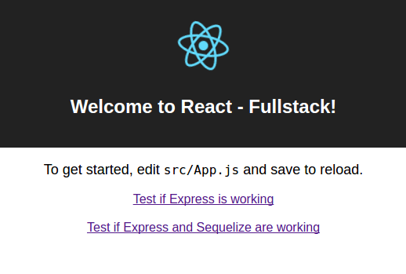

# create-react-app-fullstack


## Installation
```
npm i -g create-react-app
npm i -g create-react-app-fullstack
```
## Getting Started
Start by creating your database with PostgreSQL if it doesn't already exist (you can do this after running 'fullstack' as well):
```
create db <my-app>
```
After creating your database, initialize a create-react-app with the same name:

```
create-react-app <my-app>
cd my-app
fullstack
```

After running *fullstack*, confirm that you want to eject and the remaining steps will update your app with Express and Sequelize. Currently, an eject is required on create-react-app to get it working properly. I'm exploring ways to work around this.

Finally, you can seed the database with dummy data by running:
```
npm run seed
```

###References and Props
Much of this work was built and taken from the resources below:
* [create-react-app](https://www.npmjs.com/package/create-react-app)
* [create-react-app-add-redux](https://www.npmjs.com/package/create-react-app-add-redux)
* [custom-react-scripts](https://www.npmjs.com/package/custom-react-scripts)
* [Using create-react-app with React Router + Express.js]()
* [How to get "create-react-app" to work with your API]()

Currently, this repo adds *Express* and *Sequelize* to the mix for create-react-app. On the backlog are *Redux* and *SASS*, but some of the links above already have functionality for that.

Last, this project was built at a hackathon at [Full Stack Academy](https://www.fullstackacademy.com/). Development is preliminary.
